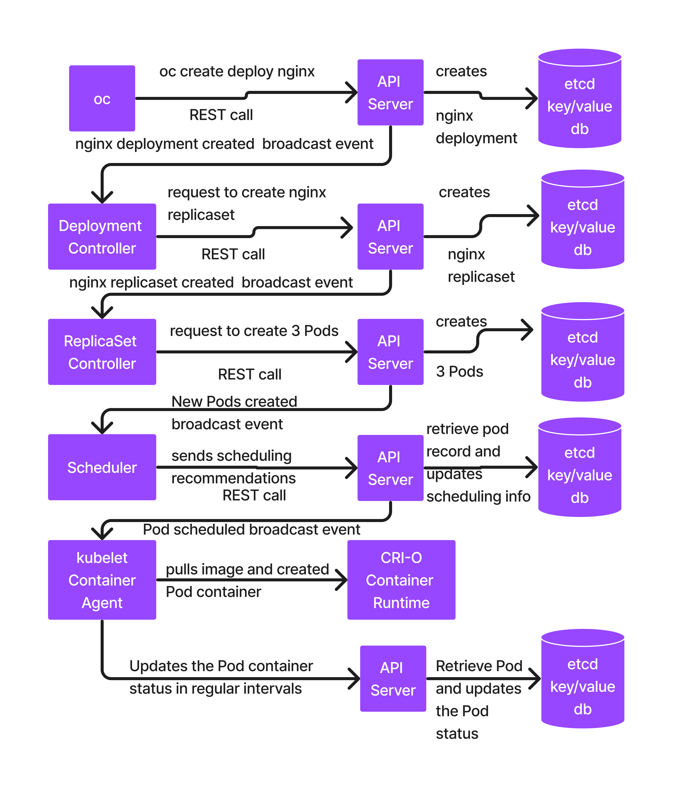

# Day1
## What is Container Runtime?
- is a low-level software that knows how manage containers
  - create a new container
  - listing running containers
  - listing exited containers
  - start/stopping/restarting/deleting/aborting containers
- they aren't so user-friendly, hence normally no end-users use it directly

## What is a Container Engine ?
- is a high-level software that provides user-friendly commands to manage container images and containers
- Container Engines internally makes use of Container Runtime to manage containers
- For example:
  - Docker Container Engine depends on runC Container Runtime
  - Podman Container Engine depends on CRI-O Container Runtime
  
## Docker Overview
- Application Virtualization Technology
- each container represents one running application
- in other words, each container is an application process
- containers don't get their own dedicated hardware resources
- containers are not OS
- containers will never be able to replace Virtual Machine or Operating System
- Certain features of Containers appears similar to an Operating System
- Just like Virtual Machines get an IP address, even container gets their own IP address
- Just like Virtual machines has it own file system, even container has its file sytem
- Virtual Machine with Linux distributions has its own package managers to install/uninstall/update/upgrade softwares, same way container also has its own package managers
- Unlike Virtual machines, the containers runs only one single application wherease VMs are fully functional Operating System hence many applications can run in the operating system installed within Virtual Machine.
- is a Container Engine

## What is a Container Orchestration Platform?
- Orchestration Platform tools helps us manage containerized application workloads
- containerized application workloads could be
  - Microservices
  - Web servers
  - Application Servers
  - REST/SOAP/Web Services
  - DB Servers
  
- they works as a cluster of servers
- Examples
  - Docker SWARM ( supports only managing Docker containerized applications )
  - Google Kubernetes ( supports many different container runtimes unlike Docker SWARM )
    - Opensource and free for personal and commercial use
    - is a production grade, robust orchestration platform
  
  - Red Hat OpenShift ( supports only CRI-O container runtime and Podman Container Engine )
    - developed on top of the opensource Google Kubernetes
    - hence OpenShift supports all the features of Kubernetes
    - OpenShift also supports many additional features which aren't supported by Kubernetes
    - This is an enterprise grade Orchestration platform that requires license from Red Hat

- advantages of using Orchestration Platforms
  - Orchestration Platforms provides an eco-system/environment where you could make your deployed applications highly available(HA)
  - Scaling up/down your application instances is easy on demand
  - Rolling update ie you can upgrade your application workloads from one version to other without any downtime
  - provides in-built monitoring features to check health, liveniness checks for your application workloads
  - load balances features supports both internal and external load balancers

## OpenShift Overview
- Red Hat OpenShift is developed on top of Google Kubernetes
- OpenShift supports all the features of Kubernetes + many additional features
- Google Kubernetes supports Operators and Custom Resources, with this Kuberenetes allows extending Kubernetes functaionalities
- Using the Operators and Custom Resources,the Red Team has add many additional features on top of Kubernetes which is distributed in the name of Red Hat OpenShift
- In other words, Openshift is Red Hat's variant of Kubernetes

## OpenShift Alternatives
- Docker SWARM
  - it is very user-friendly
  - light weight
  - can be easily installed on laptops with normal configurations
  - easy to learn
  - it is not production grade orchestration platform, hence normally used for learning, protyping, dev/qa environments
  
- Google Kubernetes
  - supports only Command Line
  - production grade
  - open source, hence can be used for personal and commercial purpose
  - it does support Kubernetes Dashboard (Web console) as it doesn't support multi-users or login credentails it is considered insecure and opens up some security issues, hence this is one of the first thing Systems Admins disable
 
## OpenShift High Level Architecture

## OpenShift Common Resources
- Pod
  - group of CRI-o containers, a configuration(JSON object) that is stored/managed within etcd database
  - group of containers
  - In Kubernetes/OpenShift IP address is assigned only on the Pod level not on the container level
  - one Pod represents one running instance of an application
  - ideally only one main application should be running within a Pod
- ReplicaSet 
  - a configuration that is stored/managed within etcd database
  - is a JSON object
  - how many Pods are supposed to running for a specific application deployment
  - one or more Pods
  - each ReplicaSet represents one version of an Application deployment
- Deployment
  - is a JSON Object
  - stored within etcd database
  - has one or more ReplicaSets
  - this reprents your application deployed within Openshift
- Controllers
  - are the one which monitors and manages one specific type of OpenShift Resource
  - Deployment Controller
  - ReplicaSet Controller
  - Endpoint Controller
  - Job Controller
  - StatefulSet Controller
  - DaemonSet Controller

## Openshift components/tools
- kubectl - Kubernetes command-line client tool
- oc - openshift command-line client tool
- kubelet
  - container agent that runs as a service in all the nodes of OpenShift
  - this runs in master as well as worker node
  - this component interacts with the Container Runtime to pull images and manage containers/pods
- kube-proxy
  - is a components that runs in every node i.e worker and master nodes
  - provides load-balancing to group of pods that belongs to a specific deployment

# Lab Exercises

## Lab - Checking Docker version
```
docker --version
```

## Lab - Listing Docker images
```
docker images
```

## Lab - Listing all running containers
```
docker ps
```

## Lab - Listing all containers running and exited
```
docker ps -a
```

## Lab - Creating multi containers (Pod) and letting them share same IP in Docker
```
docker run -d --name ubuntu_pause --hostname ubuntu1 google/pause:latest
docker run -dit --name ubuntu1 --network=container:ubuntu_pause ubuntu:22.04 bash
```

Listing the running containers
```
docker ps
```

Finding the IP Address of ubuntu_pause container
```
docker inspect ubuntu_pause | grep IPA
```

Finding the IP Address of ubuntu1 containers
```
docker exec -it ubuntu1 /bin/bash
hostname -i
exit
```

As you have noticed, the ubuntu1 and ubuntu_pause containers shares the IP address, this is how Pods are created in Kubernetes/OpenShift.

## Lab - Listing all nodes in the Red Hat OpenShift cluster
```
oc get nodes
```

Expected output
<pre>
┌──(jegan㉿tektutor.org)-[~/openshift-nov-2023]
└─$ oc get nodes
NAME                             STATUS   ROLES                         AGE     VERSION
master-1.ocp.tektutor-ocp-labs   Ready    control-plane,master,worker   4h48m   v1.27.6+b49f9d1
master-2.ocp.tektutor-ocp-labs   Ready    control-plane,master,worker   4h49m   v1.27.6+b49f9d1
master-3.ocp.tektutor-ocp-labs   Ready    control-plane,master,worker   4h48m   v1.27.6+b49f9d1
worker-1.ocp.tektutor-ocp-labs   Ready    worker                        4h34m   v1.27.6+b49f9d1
worker-2.ocp.tektutor-ocp-labs   Ready    worker                        4h34m   v1.27.6+b49f9d1  
</pre>

## Lab - Checking the OpenShift version
```
oc version
```

Expected output
<pre>
┌──(jegan㉿tektutor.org)-[~/openshift-nov-2023]
└─$ oc version 
Client Version: 4.14.3
Kustomize Version: v5.0.1
Server Version: 4.14.3
Kubernetes Version: v1.27.6+b49f9d1  
</pre>

## Lab - Checking more details about the OpenShift cluster with wide mode
```
oc get nodes -o wide
```

Expected output
<pre>
┌──(jegan㉿tektutor.org)-[~/openshift-nov-2023]
└─$ oc get nodes -o wide
NAME                             STATUS   ROLES                         AGE     VERSION           INTERNAL-IP       EXTERNAL-IP   OS-IMAGE                                                       KERNEL-VERSION                 CONTAINER-RUNTIME
master-1.ocp.tektutor-ocp-labs   Ready    control-plane,master,worker   5h57m   v1.27.6+b49f9d1   192.168.122.14    <none>        Red Hat Enterprise Linux CoreOS 414.92.202311150705-0 (Plow)   5.14.0-284.41.1.el9_2.x86_64   cri-o://1.27.1-13.1.rhaos4.14.git956c5f7.el9
master-2.ocp.tektutor-ocp-labs   Ready    control-plane,master,worker   5h57m   v1.27.6+b49f9d1   192.168.122.88    <none>        Red Hat Enterprise Linux CoreOS 414.92.202311150705-0 (Plow)   5.14.0-284.41.1.el9_2.x86_64   cri-o://1.27.1-13.1.rhaos4.14.git956c5f7.el9
master-3.ocp.tektutor-ocp-labs   Ready    control-plane,master,worker   5h57m   v1.27.6+b49f9d1   192.168.122.160   <none>        Red Hat Enterprise Linux CoreOS 414.92.202311150705-0 (Plow)   5.14.0-284.41.1.el9_2.x86_64   cri-o://1.27.1-13.1.rhaos4.14.git956c5f7.el9
worker-1.ocp.tektutor-ocp-labs   Ready    worker                        5h42m   v1.27.6+b49f9d1   192.168.122.174   <none>        Red Hat Enterprise Linux CoreOS 414.92.202311150705-0 (Plow)   5.14.0-284.41.1.el9_2.x86_64   cri-o://1.27.1-13.1.rhaos4.14.git956c5f7.el9
worker-2.ocp.tektutor-ocp-labs   Ready    worker                        5h42m   v1.27.6+b49f9d1   192.168.122.96    <none>        Red Hat Enterprise Linux CoreOS 414.92.202311150705-0 (Plow)   5.14.0-284.41.1.el9_2.x86_64   cri-o://1.27.1-13.1.rhaos4.14.git956c5f7.el9  
</pre>

Red Hat OpenShift allow install either Red Hat Enterprise Linux (RHEL) or Red Hat Enterprise Core OS on Worker nodes.  For master nodes, the only choice is Red Hat Enterprise Core OS.

With wide mode, we could find the version of CRI-O Container Runtime, IP address of nodes, kernel version of Red Hat Enterprise Core OS, etc.,

## Lab - Finding node details
```
oc describe node oc describe node master-1.ocp.tektutor-ocp-labs
```

Expected output
<pre>
┌──(jegan㉿tektutor.org)-[~/openshift-nov-2023]
└─$ oc describe node master-1.ocp.tektutor-ocp-labs
Name:               master-1.ocp.tektutor-ocp-labs
Roles:              control-plane,master,worker
Labels:             beta.kubernetes.io/arch=amd64
                    beta.kubernetes.io/os=linux
                    kubernetes.io/arch=amd64
                    kubernetes.io/hostname=master-1.ocp.tektutor-ocp-labs
                    kubernetes.io/os=linux
                    node-role.kubernetes.io/control-plane=
                    node-role.kubernetes.io/master=
                    node-role.kubernetes.io/worker=
                    node.openshift.io/os_id=rhcos
Annotations:        machineconfiguration.openshift.io/controlPlaneTopology: HighlyAvailable
                    machineconfiguration.openshift.io/currentConfig: rendered-master-ca68def14fd1acac1dcff8c720f4fabf
                    machineconfiguration.openshift.io/desiredConfig: rendered-master-ca68def14fd1acac1dcff8c720f4fabf
                    machineconfiguration.openshift.io/desiredDrain: uncordon-rendered-master-ca68def14fd1acac1dcff8c720f4fabf
                    machineconfiguration.openshift.io/lastAppliedDrain: uncordon-rendered-master-ca68def14fd1acac1dcff8c720f4fabf
                    machineconfiguration.openshift.io/lastSyncedControllerConfigResourceVersion: 23159
                    machineconfiguration.openshift.io/reason: 
                    machineconfiguration.openshift.io/state: Done
                    volumes.kubernetes.io/controller-managed-attach-detach: true
CreationTimestamp:  Mon, 27 Nov 2023 08:18:14 +0530
Taints:             <none>
Unschedulable:      false
Lease:
  HolderIdentity:  master-1.ocp.tektutor-ocp-labs
  AcquireTime:     <unset>
  RenewTime:       Mon, 27 Nov 2023 14:20:34 +0530
Conditions:
  Type             Status  LastHeartbeatTime                 LastTransitionTime                Reason                       Message
  ----             ------  -----------------                 ------------------                ------                       -------
  MemoryPressure   False   Mon, 27 Nov 2023 14:16:11 +0530   Mon, 27 Nov 2023 08:18:14 +0530   KubeletHasSufficientMemory   kubelet has sufficient memory available
  DiskPressure     False   Mon, 27 Nov 2023 14:16:11 +0530   Mon, 27 Nov 2023 08:18:14 +0530   KubeletHasNoDiskPressure     kubelet has no disk pressure
  PIDPressure      False   Mon, 27 Nov 2023 14:16:11 +0530   Mon, 27 Nov 2023 08:18:14 +0530   KubeletHasSufficientPID      kubelet has sufficient PID available
  Ready            True    Mon, 27 Nov 2023 14:16:11 +0530   Mon, 27 Nov 2023 08:23:00 +0530   KubeletReady                 kubelet is posting ready status
Addresses:
  InternalIP:  192.168.122.14
  Hostname:    master-1.ocp.tektutor-ocp-labs
Capacity:
  cpu:                4
  ephemeral-storage:  51837932Ki
  hugepages-1Gi:      0
  hugepages-2Mi:      0
  memory:             15980256Ki
  pods:               250
Allocatable:
  cpu:                3500m
  ephemeral-storage:  46700096229
  hugepages-1Gi:      0
  hugepages-2Mi:      0
  memory:             14829280Ki
  pods:               250
System Info:
  Machine ID:                                  fb8fed79a8464960bebbc6a2af8479ad
  System UUID:                                 fb8fed79-a846-4960-bebb-c6a2af8479ad
  Boot ID:                                     3ba0d9e3-014a-456a-b358-e17a3e98a069
  Kernel Version:                              5.14.0-284.41.1.el9_2.x86_64
  OS Image:                                    Red Hat Enterprise Linux CoreOS 414.92.202311150705-0 (Plow)
  Operating System:                            linux
  Architecture:                                amd64
  Container Runtime Version:                   cri-o://1.27.1-13.1.rhaos4.14.git956c5f7.el9
  Kubelet Version:                             v1.27.6+b49f9d1
  Kube-Proxy Version:                          v1.27.6+b49f9d1
Non-terminated Pods:                           (39 in total)
  Namespace                                    Name                                                             CPU Requests  CPU Limits  Memory Requests  Memory Limits  Age
  ---------                                    ----                                                             ------------  ----------  ---------------  -------------  ---
  openshift-apiserver                          apiserver-7f7cc84b75-hf7g6                                       110m (3%)     0 (0%)      250Mi (1%)       0 (0%)         5h43m
  openshift-authentication                     oauth-openshift-7d99c85f84-jsqpz                                 10m (0%)      0 (0%)      50Mi (0%)        0 (0%)         5h47m
  openshift-cloud-controller-manager-operator  cluster-cloud-controller-manager-operator-56b94ddf69-rc58w       20m (0%)      0 (0%)      75Mi (0%)        0 (0%)         6h2m
  openshift-cluster-node-tuning-operator       tuned-sjn8b                                                      10m (0%)      0 (0%)      50Mi (0%)        0 (0%)         5h56m
  openshift-cluster-storage-operator           csi-snapshot-controller-5fbf758969-frkh2                         10m (0%)      0 (0%)      50Mi (0%)        0 (0%)         5h57m
  openshift-cluster-storage-operator           csi-snapshot-webhook-db96ddfcb-trqg8                             10m (0%)      0 (0%)      20Mi (0%)        0 (0%)         5h57m
  openshift-controller-manager                 controller-manager-6865d48dff-k4qpg                              100m (2%)     0 (0%)      100Mi (0%)       0 (0%)         5h47m
  openshift-dns                                dns-default-c7p5x                                                60m (1%)      0 (0%)      110Mi (0%)       0 (0%)         5h56m
  openshift-dns                                node-resolver-kzfrq                                              5m (0%)       0 (0%)      21Mi (0%)        0 (0%)         5h56m
  openshift-etcd                               etcd-guard-master-1.ocp.tektutor-ocp-labs                        10m (0%)      0 (0%)      5Mi (0%)         0 (0%)         5h55m
  openshift-etcd                               etcd-master-1.ocp.tektutor-ocp-labs                              360m (10%)    0 (0%)      910Mi (6%)       0 (0%)         5h47m
  openshift-image-registry                     image-registry-7b465595c9-n6clv                                  100m (2%)     0 (0%)      256Mi (1%)       0 (0%)         5h46m
  openshift-image-registry                     node-ca-zllw7                                                    10m (0%)      0 (0%)      10Mi (0%)        0 (0%)         5h48m
  openshift-ingress-canary                     ingress-canary-599bn                                             10m (0%)      0 (0%)      20Mi (0%)        0 (0%)         5h51m
  openshift-ingress                            router-default-885dc768d-f76sg                                   100m (2%)     0 (0%)      256Mi (1%)       0 (0%)         5h47m
  openshift-kube-apiserver                     kube-apiserver-guard-master-1.ocp.tektutor-ocp-labs              10m (0%)      0 (0%)      5Mi (0%)         0 (0%)         5h53m
  openshift-kube-apiserver                     kube-apiserver-master-1.ocp.tektutor-ocp-labs                    290m (8%)     0 (0%)      1224Mi (8%)      0 (0%)         5h42m
  openshift-kube-controller-manager            kube-controller-manager-guard-master-1.ocp.tektutor-ocp-labs     10m (0%)      0 (0%)      5Mi (0%)         0 (0%)         5h52m
  openshift-kube-controller-manager            kube-controller-manager-master-1.ocp.tektutor-ocp-labs           80m (2%)      0 (0%)      500Mi (3%)       0 (0%)         5h41m
  openshift-kube-scheduler                     openshift-kube-scheduler-guard-master-1.ocp.tektutor-ocp-labs    10m (0%)      0 (0%)      5Mi (0%)         0 (0%)         5h48m
  openshift-kube-scheduler                     openshift-kube-scheduler-master-1.ocp.tektutor-ocp-labs          25m (0%)      0 (0%)      150Mi (1%)       0 (0%)         5h44m
  openshift-machine-config-operator            machine-config-daemon-566qc                                      40m (1%)      0 (0%)      100Mi (0%)       0 (0%)         5h55m
  openshift-machine-config-operator            machine-config-server-65ntb                                      20m (0%)      0 (0%)      50Mi (0%)        0 (0%)         5h55m
  openshift-monitoring                         node-exporter-95zv9                                              9m (0%)       0 (0%)      47Mi (0%)        0 (0%)         5h54m
  openshift-monitoring                         prometheus-adapter-7dd89d6d4b-r5xtt                              1m (0%)       0 (0%)      40Mi (0%)        0 (0%)         5h48m
  openshift-monitoring                         prometheus-operator-admission-webhook-84b7fffcdc-b9qdg           5m (0%)       0 (0%)      30Mi (0%)        0 (0%)         5h55m
  openshift-monitoring                         thanos-querier-69ffdf96db-gwlrx                                  15m (0%)      0 (0%)      92Mi (0%)        0 (0%)         5h48m
  openshift-multus                             multus-7f7md                                                     10m (0%)      0 (0%)      65Mi (0%)        0 (0%)         6h1m
  openshift-multus                             multus-additional-cni-plugins-qscpq                              10m (0%)      0 (0%)      10Mi (0%)        0 (0%)         6h1m
  openshift-multus                             multus-admission-controller-fd5c466d-rcwzw                       20m (0%)      0 (0%)      70Mi (0%)        0 (0%)         5h55m
  openshift-multus                             network-metrics-daemon-vndsq                                     20m (0%)      0 (0%)      120Mi (0%)       0 (0%)         6h1m
  openshift-network-diagnostics                network-check-target-rwqlj                                       10m (0%)      0 (0%)      15Mi (0%)        0 (0%)         6h1m
  openshift-network-node-identity              network-node-identity-hvvnl                                      20m (0%)      0 (0%)      100Mi (0%)       0 (0%)         6h
  openshift-network-operator                   network-operator-67845fb87b-gn9kk                                10m (0%)      0 (0%)      50Mi (0%)        0 (0%)         6h1m
  openshift-oauth-apiserver                    apiserver-545754bbb6-shpvl                                       150m (4%)     0 (0%)      200Mi (1%)       0 (0%)         5h51m
  openshift-route-controller-manager           route-controller-manager-7ccb5b8-2wqwc                           100m (2%)     0 (0%)      100Mi (0%)       0 (0%)         5h47m
  openshift-sdn                                sdn-controller-qth74                                             20m (0%)      0 (0%)      70Mi (0%)        0 (0%)         6h1m
  openshift-sdn                                sdn-x5cfz                                                        110m (3%)     0 (0%)      220Mi (1%)       0 (0%)         6h1m
  openshift-service-ca                         service-ca-568ccf6fcb-8pnjv                                      10m (0%)      0 (0%)      120Mi (0%)       0 (0%)         5h56m
Allocated resources:
  (Total limits may be over 100 percent, i.e., overcommitted.)
  Resource           Requests      Limits
  --------           --------      ------
  cpu                1930m (55%)   0 (0%)
  memory             5571Mi (38%)  0 (0%)
  ephemeral-storage  0 (0%)        0 (0%)
  hugepages-1Gi      0 (0%)        0 (0%)
  hugepages-2Mi      0 (0%)        0 (0%)
Events:              <none>  
</pre>

## Lab - Listing projects/namespaces
```
oc get namespaces
oc get projects
```

Expected ouput
<pre>
┌──(jegan㉿tektutor.org)-[~/openshift-nov-2023]
└─$ oc get namespaces   
NAME                                               STATUS   AGE
default                                            Active   6h16m
kube-node-lease                                    Active   6h16m
kube-public                                        Active   6h16m
kube-system                                        Active   6h16m
openshift                                          Active   6h4m
openshift-apiserver                                Active   6h7m
openshift-apiserver-operator                       Active   6h15m
openshift-authentication                           Active   6h7m
openshift-authentication-operator                  Active   6h15m
openshift-cloud-controller-manager                 Active   6h15m
openshift-cloud-controller-manager-operator        Active   6h15m
openshift-cloud-credential-operator                Active   6h15m
openshift-cloud-network-config-controller          Active   6h15m
openshift-cluster-csi-drivers                      Active   6h15m
openshift-cluster-machine-approver                 Active   6h15m
openshift-cluster-node-tuning-operator             Active   6h15m
openshift-cluster-samples-operator                 Active   6h15m
openshift-cluster-storage-operator                 Active   6h15m
openshift-cluster-version                          Active   6h16m
openshift-config                                   Active   6h15m
openshift-config-managed                           Active   6h15m
openshift-config-operator                          Active   6h15m
openshift-console                                  Active   6h
openshift-console-operator                         Active   6h
openshift-console-user-settings                    Active   6h
openshift-controller-manager                       Active   6h8m
openshift-controller-manager-operator              Active   6h15m
openshift-dns                                      Active   6h7m
openshift-dns-operator                             Active   6h15m
openshift-etcd                                     Active   6h16m
openshift-etcd-operator                            Active   6h15m
openshift-host-network                             Active   6h12m
openshift-image-registry                           Active   6h15m
openshift-infra                                    Active   6h16m
openshift-ingress                                  Active   6h7m
openshift-ingress-canary                           Active   6h3m
openshift-ingress-operator                         Active   6h15m
openshift-insights                                 Active   6h15m
openshift-kni-infra                                Active   6h15m
openshift-kube-apiserver                           Active   6h16m
openshift-kube-apiserver-operator                  Active   6h16m
openshift-kube-controller-manager                  Active   6h16m
openshift-kube-controller-manager-operator         Active   6h16m
openshift-kube-scheduler                           Active   6h16m
openshift-kube-scheduler-operator                  Active   6h15m
openshift-kube-storage-version-migrator            Active   6h8m
openshift-kube-storage-version-migrator-operator   Active   6h15m
openshift-machine-api                              Active   6h15m
openshift-machine-config-operator                  Active   6h15m
openshift-marketplace                              Active   6h15m
openshift-monitoring                               Active   6h15m
openshift-multus                                   Active   6h12m
openshift-network-diagnostics                      Active   6h12m
openshift-network-node-identity                    Active   6h12m
openshift-network-operator                         Active   6h15m
openshift-node                                     Active   6h4m
openshift-nutanix-infra                            Active   6h15m
openshift-oauth-apiserver                          Active   6h7m
openshift-openstack-infra                          Active   6h15m
openshift-operator-lifecycle-manager               Active   6h15m
openshift-operators                                Active   6h15m
openshift-ovirt-infra                              Active   6h15m
openshift-route-controller-manager                 Active   6h8m
openshift-sdn                                      Active   6h12m
openshift-service-ca                               Active   6h8m
openshift-service-ca-operator                      Active   6h15m
openshift-user-workload-monitoring                 Active   6h15m
openshift-vsphere-infra                            Active   6h15m
                                                                                                                                        
┌──(jegan㉿tektutor.org)-[~/openshift-nov-2023]
└─$ oc get projects  
NAME                                               DISPLAY NAME   STATUS
default                                                           Active
kube-node-lease                                                   Active
kube-public                                                       Active
kube-system                                                       Active
openshift                                                         Active
openshift-apiserver                                               Active
openshift-apiserver-operator                                      Active
openshift-authentication                                          Active
openshift-authentication-operator                                 Active
openshift-cloud-controller-manager                                Active
openshift-cloud-controller-manager-operator                       Active
openshift-cloud-credential-operator                               Active
openshift-cloud-network-config-controller                         Active
openshift-cluster-csi-drivers                                     Active
openshift-cluster-machine-approver                                Active
openshift-cluster-node-tuning-operator                            Active
openshift-cluster-samples-operator                                Active
openshift-cluster-storage-operator                                Active
openshift-cluster-version                                         Active
openshift-config                                                  Active
openshift-config-managed                                          Active
openshift-config-operator                                         Active
openshift-console                                                 Active
openshift-console-operator                                        Active
openshift-console-user-settings                                   Active
openshift-controller-manager                                      Active
openshift-controller-manager-operator                             Active
openshift-dns                                                     Active
openshift-dns-operator                                            Active
openshift-etcd                                                    Active
openshift-etcd-operator                                           Active
openshift-host-network                                            Active
openshift-image-registry                                          Active
openshift-infra                                                   Active
openshift-ingress                                                 Active
openshift-ingress-canary                                          Active
openshift-ingress-operator                                        Active
openshift-insights                                                Active
openshift-kni-infra                                               Active
openshift-kube-apiserver                                          Active
openshift-kube-apiserver-operator                                 Active
openshift-kube-controller-manager                                 Active
openshift-kube-controller-manager-operator                        Active
openshift-kube-scheduler                                          Active
openshift-kube-scheduler-operator                                 Active
openshift-kube-storage-version-migrator                           Active
openshift-kube-storage-version-migrator-operator                  Active
openshift-machine-api                                             Active
openshift-machine-config-operator                                 Active
openshift-marketplace                                             Active
openshift-monitoring                                              Active
openshift-multus                                                  Active
openshift-network-diagnostics                                     Active
openshift-network-node-identity                                   Active
openshift-network-operator                                        Active
openshift-node                                                    Active
openshift-nutanix-infra                                           Active
openshift-oauth-apiserver                                         Active
openshift-openstack-infra                                         Active
openshift-operator-lifecycle-manager                              Active
openshift-operators                                               Active
openshift-ovirt-infra                                             Active
openshift-route-controller-manager                                Active
openshift-sdn                                                     Active
openshift-service-ca                                              Active
openshift-service-ca-operator                                     Active
openshift-user-workload-monitoring                                Active
openshift-vsphere-infra                                           Active                                                                    </pre>

## Lab - Creating a project
```
oc new-project jegan
```

Expected output
<pre>
┌──(jegan㉿tektutor.org)-[~/openshift-nov-2023]
└─$ oc new-project jegan                                                                                             
Now using project "jegan" on server "https://api.ocp.tektutor-ocp-labs:6443".

You can add applications to this project with the 'new-app' command. For example, try:

    oc new-app rails-postgresql-example

to build a new example application in Ruby. Or use kubectl to deploy a simple Kubernetes application:

    kubectl create deployment hello-node --image=registry.k8s.io/e2e-test-images/agnhost:2.43 -- /agnhost serve-hostname
</pre>

## Lab - Checking the currently active project
```
oc project
```

Expected output
<pre>
┌──(jegan㉿tektutor.org)-[~/openshift-nov-2023]
└─$ oc project          
Using project "jegan" on server "https://api.ocp.tektutor-ocp-labs:6443".
</pre>

## Lab - Switching between projects
```
oc project default
oc project jegan
```

Expected output
<pre>
┌──(jegan㉿tektutor.org)-[~/openshift-nov-2023]
└─$ oc project default
Now using project "default" on server "https://api.ocp.tektutor-ocp-labs:6443".
                                                                                                                                        
┌──(jegan㉿tektutor.org)-[~/openshift-nov-2023]
└─$ oc project jegan  
Now using project "jegan" on server "https://api.ocp.tektutor-ocp-labs:6443".
</pre>

## Lab - Deploying your first application using imperative style
Replace 'jegan' with your name.
```
oc project jegan
oc create deployment nginx --image=nginx:latest
```

Expected output
<pre>
┌──(jegan㉿tektutor.org)-[~/openshift-nov-2023]
└─$ oc create deployment nginx --image=nginx:latest                                                    
deployment.apps/nginx created
                                                                                                                                        
┌──(jegan㉿tektutor.org)-[~/openshift-nov-2023]
└─$ oc get deployments                             
NAME    READY   UP-TO-DATE   AVAILABLE   AGE
nginx   0/1     1            0           5s
                                                                                                                                        
┌──(jegan㉿tektutor.org)-[~/openshift-nov-2023]
└─$ oc get replicasets
NAME               DESIRED   CURRENT   READY   AGE
nginx-7bf8c77b5b   1         1         0       8s
                                                                                                                                        
┌──(jegan㉿tektutor.org)-[~/openshift-nov-2023]
└─$ oc get pods       
NAME                     READY   STATUS              RESTARTS   AGE
nginx-7bf8c77b5b-nfxx2   0/1     ContainerCreating   0          11s
</pre>


## Lab - Troubleshooting deployment issues

Red Hat Enterprise Linux Core OS doesn't allow Pods to write to certain folders like /var.  Also the Core OS doesn't allow applications to run as root user.  It is for these two reasons, the nginx pod is not running.  

The docker image is not created in a way that is suitable for Red Hat OpenShift, as it violates many best practices expected by OpenShift.
Hence, in the next lab exercise we will try to deploy nginx with bitnami/nginx:latest image which follows all the best practices expected by OpenShift.

```
oc get pods
oc get replicasets
oc get deployments
```

Checking pod logs
```
oc logs pod/nginx-7bf8c77b5b-nfxx2
```

Expected output
<pre>
┌──(jegan㉿tektutor.org)-[~/openshift-nov-2023]
└─$ oc get pods
NAME                     READY   STATUS             RESTARTS      AGE
nginx-7bf8c77b5b-nfxx2   0/1     CrashLoopBackOff   5 (13s ago)   3m32s
                                                                                                                                        
┌──(jegan㉿tektutor.org)-[~/openshift-nov-2023]
└─$ oc logs pods/nginx-7bf8c77b5b-nfxx2
/docker-entrypoint.sh: /docker-entrypoint.d/ is not empty, will attempt to perform configuration
/docker-entrypoint.sh: Looking for shell scripts in /docker-entrypoint.d/
/docker-entrypoint.sh: Launching /docker-entrypoint.d/10-listen-on-ipv6-by-default.sh
10-listen-on-ipv6-by-default.sh: info: can not modify /etc/nginx/conf.d/default.conf (read-only file system?)
/docker-entrypoint.sh: Sourcing /docker-entrypoint.d/15-local-resolvers.envsh
/docker-entrypoint.sh: Launching /docker-entrypoint.d/20-envsubst-on-templates.sh
/docker-entrypoint.sh: Launching /docker-entrypoint.d/30-tune-worker-processes.sh
/docker-entrypoint.sh: Configuration complete; ready for start up
2023/11/27 09:14:44 [warn] 1#1: the "user" directive makes sense only if the master process runs with super-user privileges, ignored in /etc/nginx/nginx.conf:2
nginx: [warn] the "user" directive makes sense only if the master process runs with super-user privileges, ignored in /etc/nginx/nginx.conf:2
2023/11/27 09:14:44 [emerg] 1#1: mkdir() "/var/cache/nginx/client_temp" failed (13: Permission denied)
nginx: [emerg] mkdir() "/var/cache/nginx/client_temp" failed (13: Permission denied)
                                                                                                                                        
┌──(jegan㉿tektutor.org)-[~/openshift-nov-2023]
└─$ oc get replicasets                 
NAME               DESIRED   CURRENT   READY   AGE
nginx-7bf8c77b5b   1         1         0       7m30s
                                                                                                                                        
┌──(jegan㉿tektutor.org)-[~/openshift-nov-2023]
└─$ oc get deployments
NAME    READY   UP-TO-DATE   AVAILABLE   AGE
nginx   0/1     1            0           7m49s
</pre>

## Listing all deployments
```
oc get deployments
oc get deployment
oc get deploy
```

Expected output
<pre>
┌──(jegan㉿tektutor.org)-[~/openshift-nov-2023]
└─$ oc get deployments
NAME    READY   UP-TO-DATE   AVAILABLE   AGE
nginx   0/1     1            0           7m49s
                                                                                                                                        
┌──(jegan㉿tektutor.org)-[~/openshift-nov-2023]
└─$ oc get deployments                             
NAME    READY   UP-TO-DATE   AVAILABLE   AGE
nginx   0/1     1            0           12m
                                                                                                                                        
┌──(jegan㉿tektutor.org)-[~/openshift-nov-2023]
└─$ oc get deployment 
NAME    READY   UP-TO-DATE   AVAILABLE   AGE
nginx   0/1     1            0           13m
                                                                                                                                        
┌──(jegan㉿tektutor.org)-[~/openshift-nov-2023]
└─$ oc get deploy    
NAME    READY   UP-TO-DATE   AVAILABLE   AGE
nginx   0/1     1            0           13m  
</pre>

## Lab - Listing replicasets
```
oc get replicasets
oc get replicaset
oc get rs
```

Expected output
<pre>
┌──(jegan㉿tektutor.org)-[~/openshift-nov-2023]
└─$ oc get replicasets
No resources found in jegan namespace.
                                                                                                                                        
┌──(jegan㉿tektutor.org)-[~/openshift-nov-2023]
└─$ oc get replicaset 
No resources found in jegan namespace.
                                                                                                                                        
┌──(jegan㉿tektutor.org)-[~/openshift-nov-2023]
└─$ oc get rs                                        
No resources found in jegan namespace.  
</pre>


## Lab - Listing pods
```
oc get pods
oc get pod
oc get po
```

Expected output
<pre>
┌──(jegan㉿tektutor.org)-[~/openshift-nov-2023]
└─$ oc get pods
No resources found in jegan namespace.
                                                                                                                                        
┌──(jegan㉿tektutor.org)-[~/openshift-nov-2023]
└─$ oc get pod 
No resources found in jegan namespace.
                                                                                                                                        
┌──(jegan㉿tektutor.org)-[~/openshift-nov-2023]
└─$ oc get po 
No resources found in jegan namespace.  
</pre>

## Lab - Deleting the nginx deployment
```
oc get deploy,rs,po
oc delete deploy/nginx
oc get deploy,rs,po
```

Expected output


## Lab - Creating nginx deployment with bitnami/nginx docker image
To come out of the watch mode, press Ctrl + c

```
oc get deploy,rs,po

oc create deployment nginx --image=bitnami/nginx:latest

oc get deploy,rs,po
oc get po -w
```

Expected output


## Info - What happens internally within OpenShift when we create a deployment


## Lab - Scale up the number of Pods in nginx deployment

To exit the watch mode, you can use "Ctrl+C"
```
oc get po
oc scale deploy/nginx --replicas=3
oc get po -w
```

Expected output


## Lab - Find details about a replicaset
```
oc describe rs/nginx-bb865dc5f
```

Expected ouptut


## Lab - Understanding the use of Labels as Selectors
```
oc get po --show-labels
oc describe rs/nginx-bb865dc5f
oc get po -l app=nginx,pod-template-hash=bb865dc5f
```

Expected output


## Lab - Listing all container images present in the OpenShift's Local Container Registry
```
oc get imagestreams -n openshift
```

Expected output


## Lab - Listing pods from all namespaces
```
oc get pods --all-namespaces
oc get pods --all-namespaces -o wide
```

Expected output


## Lab - Getting inside a Pod shell
```
oc rsh deploy/nginx
```

Expected output


## Lab - Getting inside a specific Pod shell
```
oc get pods
oc exec -it nginx-bb865dc5f-whgg6 sh
```

Expected output


## Lab - Finding the IP address of a Pod
```
oc get pods -o wide
```

Expected output
<pre>
┌──(jegan㉿tektutor.org)-[~/openshift-nov-2023]
└─$ oc get pods -o wide
NAME                    READY   STATUS    RESTARTS   AGE   IP            NODE                             NOMINATED NODE   READINESS GATES
nginx-bb865dc5f-whgg6   1/1     Running   0          55m   10.131.0.11   worker-2.ocp.tektutor-ocp-labs   <none>           <none>
</pre>

## Lab - Port forward a Pod to test/troubleshooting purpose
To stop the port-forward, press "Ctrl+C".  Port forwarding is used only for testing/troubleshooting purpose, must be avoided in production
```
oc port-forward nginx-bb865dc5f-whgg6 8001:8080
```

Expected output


## Info - OpenShift Services

Supports two types of services
1. Internal Service and
2. External Service

Internal Services
- ClusterIP is the internal service supported by Kubernetes/OpenShift
- ClusterIP service it makes use of internal load-balancer supported by kube-proxy component that runs in every node on the openshift cluster
- Examples
  DB servers are exposed as Internal ClusterIP Services so that they are only available to applications running within the same openshift cluster

External Services
Two types
1. NodePort Service
   - uses port-forward mechnanism on every node
   - when you deploy your application in k8s/openshift you could expose the application to external world using node-port
   - k8s/openshift reserves port 30000-32767 port range on every node for Node Port external service
   - when you create a nodeport service for your application deployment, K8s/OpenShift picks a port in the above range that is available on all the nodes within the cluster and reserves that port for your application
   - depends on internal load-balancer supplied by kube-proxy component that runs on every node within K8s/openshift
    Drawbacks of NodePort External Service
   - it is not user-friendly for external users as the url would look something like www.facebook.com:32478
   - it is good for application consumption only
   - it also forces us to open up many ports in the firewall, which could lead to security issues
   - Kubernetes supports NodePort as the only external service with internal load balancer

2. Load Balancer Service
   - also is an external service
   - uses external load balancer not the one supplied by kube-proxy
   - meant to be used in public cloud environments like AWS, Azure, GCP, etc.,
   - but it also works in on-prem if you use MetalLB operator
   - supported in both Kubernetes/OpenShift
   - Advantages - The pods could come from multi-cluster, multi-cloud
   - Drawbacks - Expensive,each Load Balancer services spins a External Load Balancer in AWS/GCP/Azure which will attract charges

Red Hat OpenShift also support something called Router
- In practical world, openshift users always create an Internal Service (ClusterIP)
- If they wanted to keep it as internal only service, then no routes are created
- If they wanted to expose the application to outside world then they create a route for the ClusterIP Internal service
- In OpenShift normally no one uses node-port external service
